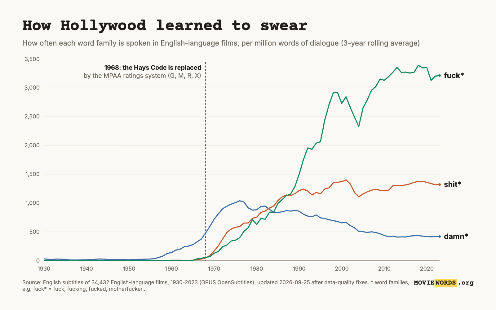

# Data quality: why some old films said "fuck", and what we did about it

moviewords.org counts the words in one subtitle file per film. After launch
(Show HN and Reddit, 2026-09-24), people noticed things that couldn't be
right: 1950s westerns swearing like Scorsese films, a 1927 silent film with
a full modern vocabulary, the wrong film's words on a film's page. This doc
explains what was going wrong, how we found it, and how the pipeline now
handles it. It covers four rounds of fixes, 2026-09-24/26: PRs #38, #41,
#43 and the "shit"-family round (round 4).

Technical detail lives elsewhere. The consensus design and calibration are
in `docs/superpowers/plans/2026-09-24-content-consensus-selection.md`, and
the quality-tier design and calibration in
`docs/superpowers/plans/2026-09-25-subtitle-quality.md`. The session records
are `docs/sessions/2026-Q3/2026-09-2{4,5}-*.md`.

## The root cause: a film has many subtitle files, and some are wrong

The data comes from the OPUS OpenSubtitles corpus: 34 GB of subtitles
uploaded to OpenSubtitles.org, grouped by IMDb id. A popular film's folder
holds dozens of uploads. Most are the same text re-synced to a different
video release, lightly edited, or with and without hearing-impaired tags.
But folders also contain:

- **DVD commentary tracks and featurettes.** The director talking about the
  film, not the film.
- **The wrong film.** An upload filed under the wrong IMDb id: remakes,
  same-title films, plain mistakes. Othello (1951) carried *O* (2001), a
  teen-basketball retelling. An American Werewolf in London carried *Bee
  Movie*. Avatar carried *Hindi Medium*.
- **The wrong language.** Philadelphia (1993) had a Vietnamese file filed
  as English.
- **Machine-translated "English".** For older and more obscure films,
  someone took another language's subtitles (Portuguese, Spanish, Greek...)
  and machine-translated them back into English. The film is right, but the
  words are not what was said.
- **Auto-generated captions.** YouTube speech recognition: unpunctuated,
  lower-case run-ons full of mishearings.
- **OCR damage.** Subtitles ripped from DVD images, where `I` reads as `l`
  and `ll` as `ii`: `l'm`, `lt's`, `i'ii`, `aii`, `iike`.

With one file per film, every one of these shows up directly on that
film's page, and in the trends and rankings that sum over films.

## Round 1 (PR #38): the selection rule rejected the real files

The original rule was to take the largest file whose estimated words per
minute of runtime is plausible. The estimate assumed 8 bytes of XML per
word; the real figure is about 24.5. So the "250 words/min" cap really
meant about 80 words/min, and every full-length file of a talky film was
rejected. What was left was a featurette or a partial file. The Wolf of
Wall Street showed 2,920 words instead of 22,636. **12,959 films were
silently missing**, including GoodFellas, Toy Story and 12 Angry Men. Fixing
the estimate grew the corpus from 25,515 to 35,066 English-original films.

## Round 2 (PR #41): choose by content consensus, not size

Bad files were often the *largest* in their folder (69% of the bad picks in
a 100-film study). So the pipeline now reads up to 12 files per film and
compares their content. It fingerprints each file's top content words,
groups files that agree (near-identical re-uploads count as one vote), and
takes the most typical file of the largest agreeing group. Commentary tracks
are recognisable: dense speech full of film-making words ("scene", "shot",
"director"). About **2,000 films changed content**, among them commentary
tracks replaced on Gladiator, The Lion King, Star Wars, Heat and Jaws, and
wrong films replaced on Othello, Avatar and Werewolf.

## Round 3 (PR #43): judge each file's quality

Consensus can't help when the folder has only one file, or when every file
is bad. For that we needed to recognise a bad file on its own.

### The canary: "fuck" in films made before 1968

From 1934 to 1968, Hollywood films were made under the Production Code,
which banned profanity outright. It was replaced by the MPAA ratings system
in November 1968. Before that, the word essentially never reached the screen
in mainstream films. M\*A\*S\*H (1970) is commonly cited as the first major
American studio film to use it; a few 1967 British films got there first.
So every English-original film from before 1968 where our data said "fuck"
was a lead worth reading. (1968 itself is a transition year: the ratings
arrived that November.)

Before these fixes, **56** pre-1968 English-original films in the live data
used strong profanity, and **39** of them said "fuck" (146 films counting
translated ones). We read every line in context for those 39:

| What it was | Films | Example |
|---|---|---|
| Genuine | 7 | 1960s documentaries and underground films: Warrendale, Portrait of Jason, Titicut Follies, Dont Look Back, Chelsea Girls, David Holzman's Diary, My Hustler |
| Uncertain | 3 | Primary (1960): "Well, fuck." at a vote count, plausibly candid audio |
| **Machine-translated** English | 18 | The Little Shop of Horrors (1960): "Fuck. The door is open, Frank." Banning: "Fuck the cow yellow." |
| **Auto-captions** | 7 | Murder in the Private Car (1934): "Oh fire me bite me here fuck me again" |
| Transcriber's guess | 2 | The Nasty Rabbit: "Fuck (indistinct)." |
| **Wrong film** | 2 | Sunrise (1927): a Spanish-language thriller. Lady Luck (1946): a modern urban film |

So most of the "swearing" came from files that weren't faithful to the
film. And the films those files belonged to had other damaged words too,
not just the swearing.

### Detecting each kind of bad file

- **Auto-captions are easy.** Genuine subtitles average about 5 words per
  line, nearly every line starts with a capital, and nearly every line ends
  in punctuation. Speech-recognition files run 18-24 words per line, mostly
  lower-case and unpunctuated. The two groups don't overlap.
- **Machine translation was hard.** Modern MT is fluent at the level of
  individual phrases, so an n-gram fluency model couldn't tell it apart
  from genuine dialogue. A "which decade does this vocabulary sound like"
  model couldn't either, because MT maps most words straight back. What
  worked was a **function-word fingerprint**. MT English overuses "not",
  "do", "will", "but" and uncontracted forms ("Did not you see her?"), and
  underuses "there's" and "'s". A logistic model over the 400 commonest
  words scored 0.97 AUC in cross-validation. Reading the files it flagged
  kept turning up more examples: "Mules not drink if in water there are
  corpses", "Living in secret is like lying a lie", "Consigámos one."
  (Spanish left in the middle of the "English").
- **The same detector fails on translated films,** and this was a key
  lesson. A human translation of an Italian or Finnish film reads as
  "translationese" to the model: formal and uncontracted. Only about 40% of
  the translated films it flagged were really machine output, so the model
  only judges films originally in English. For translated films we rely on
  OpenSubtitles' own machine-translation flag.
- **Wrong films are caught by cast names.** A subtitle names its film's
  characters. When one upload names none of the TMDB cast while another
  names several, the first is almost always another film. That caught a
  file about Amazon plants filed under The Fog of War, and "browser,
  interface, viewports" filed under Star Trek: Nemesis. A lone file naming
  none of the cast, though, is *not* evidence on its own: narrated films
  and films with unnamed characters (The Road's "Man" and "Boy") fail that
  test while being genuine.
- **Anachronism.** Strong profanity in an English-original, non-documentary
  film from before 1965 is itself treated as evidence of a bad file. It
  catches re-translations the style model misses, such as Showdown (1963):
  "Tell your fucking dogs to don't get too close."
- **OCR repair.** In files that show OCR damage, `l'm` becomes `I'm`, `lt's`
  becomes `it's`, `aii` becomes `all`, and so on. A change is only made when
  the corrected spelling is a far commoner English word, so names like
  Lan/Ian survive. About 5% of files are affected.
- **Silent films.** A silent film's genuine subtitle is its intertitles,
  only a few hundred words. That fell below the minimum words-per-minute
  filter, so the only file left for Sunrise (1927) was the wrong film. The
  filter is now relaxed for pre-1930 films.

### What happens to a flagged film

If a film has a clean file, the flagged ones are simply passed over:
**1,684 films** now use a better file. If *every* file is flagged, the film
keeps its page with a **"Subtitle quality: low"** note saying why, but its
words are **left out of every total, trend, chart and ranking**. That
applies to **532 films (0.8%)**: 414 machine-translated, 83 auto-captions,
and 33 flagged for anachronism. Their share is 2.4% of 1930-67
English-original films and about 1% of later ones. Nothing is deleted
outright. A film that can't be verified stays browsable, it just doesn't
count.

### Things we tried and threw away

Reading the flagged films by eye, rather than trusting the numbers, changed
three rules before shipping:

- **Dropping "commentary-only" films.** Of the 205 films this would have
  dropped, 199 were documentaries *about film-making* whose real dialogue is
  film talk: Life Itself (the Roger Ebert documentary), QT8, Milius, Ringers:
  Lord of the Fans. The other 6 were nearly wordless films: Shaun the Sheep's
  "Hmm." and "Oh.", and When Dinosaurs Ruled the Earth's invented language.
  All were kept.
- **Running the machine-translation model on translated films.** Covered
  above.
- **Flagging any lone file that names none of the cast.** It caught more
  genuine films (Cronenberg's Stereo, Astral) than wrong ones. The two real
  wrong films it found are on a manual blocklist instead.

## Result: the pre-1968 profanity line now

Pre-1968 English-original films using strong profanity dropped from
**56 to 12**.
The rest are genuine or at the edge:

- **Genuine:** 1960s direct-cinema documentaries and underground films that
  recorded real, unscripted speech: Warrendale (1967), Portrait of Jason
  (1967), Titicut Follies (1967), Dont Look Back (1967), Chelsea Girls
  (1966), David Holzman's Diary (1967), and Symbiopsychotaxiplasm: Take One
  (1968, just outside the pre-1968 count), a documentary of a film crew
  arguing.
- **Plausible but unverifiable:** Primary (1960), a direct-cinema record of
  the Kennedy-Humphrey primary: "Well, fuck." as vote counts come in.
- **Edge cases after the 1965 cutoff:** What's Up, Tiger Lily? (1966), a
  likely mishearing; A Very Special Favor (1965); You're a Big Boy Now
  (1966); Herostratus and The Touch of Her Flesh (both 1967).

So the blips left before 1968 are real history: documentaries and the
underground working outside the Production Code.

Round 4 (below) extended the check to the "shit" family. With it, the only
strong profanity left before 1965 is Primary (a documentary) and two 1961
independent dramas whose lines were read and are genuine (The Connection
and The Exiles). The audit lists 20 films before 1968, all 1960-67.

## The launch chart, redrawn

The chart from the launch posts (English-language films, per million words
of dialogue), redrawn on the cleaned data. It now counts **word families**
(fuck\* = fuck, fucking, fucked, motherfucker...): the single word "fuck" is
only about 42% of its family, against about 86% for "shit", so single words
understated the gap between the lines.

- Before 1965 all three families are now essentially flat at zero. The ~12
  per million "shit" and "fuck" that the launch chart showed around 1950 was
  bad subtitle files.
- The 1968 break is unchanged. fuck\* overtakes shit\* around 1987 and
  reaches about 3,200 per million words by 2023; damn\* fades after the 1970s.
- Source and data: `docs/launch/swearing-chart-families-2026-09-25.source.html`
  and `swearing-data-families-2026-09-25.json` (3-year rolling average, from
  the live English-original slice, low-quality films excluded).

## Round 4: "shit" before 1968, silent films, and whose cast a file names

While answering questions on Reddit, we queried the live data for the
"shit" family (shit, bullshit, shitty, shithead, shit's...) in
English-original films before 1968, instead of just "fuck". It returned 32
films, including a 1927 silent film. The anachronism check from round 3
only knew fuck and cunt, so these had slipped through. We read every hit in
context and compared it with the film's other uploads. The verdicts are in
`docs/audits/2026-09-25-pre1968-shit-family-verdicts.csv`.

| What it was | Films | Example |
|---|---|---|
| Genuine | 11 | The Connection (1961), whose heroin slang ("shit") got it banned by New York's censors; Dutchman (1966); the 1966-67 documentaries and underground films |
| Plausible but unverified | 4 | The Professionals (1966): "I don't give a shit!" in all 8 uploads; Cul-de-sac (1966); Primary (1960); Manos (1966) |
| **Transcription slip** | 4 | Passage to Marseille (1944): two uploads have "SHIT." where three others have "Hi, Grand-Père."; The Trial (1962): one transcriber finished a word the actor breaks off ("Oh, sh...") |
| **Mishearing** | 11 | Lone Star (1952): "you've been eating bird shit" (bird seed); Invasion of the Star Creatures: "No shitty-shallying" |
| **Not the film at all** | 2 | 7th Heaven (1927, silent): a modern gymnastics drama; Dog Star Man (1964, wordless): two viewers talking over it in 2022 |

The single-file mishearings are mostly recent uploads that read like
modern speech recognition: punctuated and fluent, but with lines like
"Fixate those bros for the police". Round 3's auto-caption detector only
recognises the older, unpunctuated kind.

What changed:

- **The anachronism check covers the whole family.** Films with a clean
  upload now use it (Passage to Marseille, Angel and the Badman, The Trial,
  No Place Like Homicide!, plus Bordertown, The Leather Boys and Fail Safe,
  whose flagged uploads were a slip, a variant and a featurette). Films
  whose only file has a slip go to "Subtitle quality: low": Montana Moon,
  Is My Face Red?, Torture Ship, Tripoli, Lone Star, Aunt Clara, Onionhead,
  Witness in the Dark, Too Late Blues, Something Wild and House of Women.
  The words are almost all right, but a 1952 western didn't say "shit",
  and we'd rather leave a film out than count what it never said.
- **Verified exceptions.** Two 1961 independent dramas, The Connection and
  The Exiles, genuinely use the word. They're listed in
  `pipeline/src/moviewords_pipeline/profanity_verified.txt`, and a film only
  goes on that list after its lines have been read.
- **Only English forms count.** A first version matched anything starting
  with "shit", and three films with Japanese dialogue (*shitai*,
  *shitsurei*) were flagged. Reading the flagged files caught it before
  publishing.
- **Silent films speaking at talkie rates.** Silent films' subtitles are
  their intertitles, about 10-20 words a minute, while talkies run 60-90.
  Every pre-1928 film faster than 45 words a minute was read. Four carried
  another film or a commentary track as their only file: Daddy-Long-Legs
  (1919) had the anime *Ah! My Goddess*, La Bohème (1926) Puccini's opera,
  South (1919) a historian's commentary, and 7th Heaven the gymnastics
  drama. The Power of the Press (1928) carried the 1943 film of the same
  name, beating its genuine intertitles. A word-rate *rule* would not work:
  wordy genuine intertitles (The Great White Silence, Orochi) run up to 63
  words a minute, faster than 7th Heaven's 59. So these went on the
  blocklist instead, and the audit now lists every fast silent film for
  reading. Verdicts: `docs/audits/2026-09-25-silent-era-rate-outliers.csv`.
- **Whose cast does a file name?** A new scan
  (`pipeline/scripts/scan_cast_crossfilm.py`) asks, for every chosen file,
  whether it names several distinctive character names of *another* film
  in the corpus and none of its own. Of its 19 hits, 9 legitimately share
  names (the same play, a re-cut, a documentary and a drama about one
  case). 10 were wrong films: Dark (2017) carried *Dying of the Light*,
  Hellborn carried *From Hell*, Nothing More carried Chabrol's *Nada*, and
  Vijeta (1982) had three uploads of *Viy* outvoting its one genuine file.
- **Films with no genuine file leave the site.** When a film's only upload
  is another film, there's nothing true to show, so it is removed rather
  than shown with a note: 13 films (the 5 silent or wordless ones above, 8
  from the cast scan).
- Also in this round: the 17 silent-era films admitted in round 3 got
  their TMDB records and went live (The Last Laugh, Man with a Movie
  Camera, Go West...).

## How we keep it honest

- `pipeline/scripts/audit_quality.py` reruns these checks after every
  recount and diffs them against the previous run:
  - films per quality tier
  - pre-1968 strong profanity (the fuck, cunt and shit families)
  - silent films speaking at talkie rates
  - anachronistic words ("internet" in 1941)
  - implausible words per minute
  - the machine-translation borderline cases
  - films that went wrong before
- `pipeline/src/moviewords_pipeline/mislabeled_subs.txt` blocks specific
  wrong uploads that the automatic checks can't see.
- Every choice is recorded, with its reason, in `work/selection.parquet`.

## What's still imperfect

- **Films with a single upload that belongs to another film.** Nothing
  disagrees with it. The cast scan catches it only when the other film is
  also in the corpus.
- **Modern speech-recognition files.** Punctuated machine transcripts are
  mostly right but mishear the odd word. The profanity check catches the
  mishearings that turn into swearing, not the others.
- **Machine-translated subtitles of translated films,** beyond
  OpenSubtitles' own flag.
- **About 230 English-original films in the machine-translation borderline
  zone.** About 1 in 4 of those read by eye was machine output.
- **Subtitles are transcriptions,** not scripts: condensed, occasionally
  misheard. The numbers are strongest in aggregate.

Parked follow-ups: `docs/handoffs/2026-09-26-subtitle-quality-followups.md`.
Found something wrong? Email andrew@beveridge.uk or open a GitHub issue.
